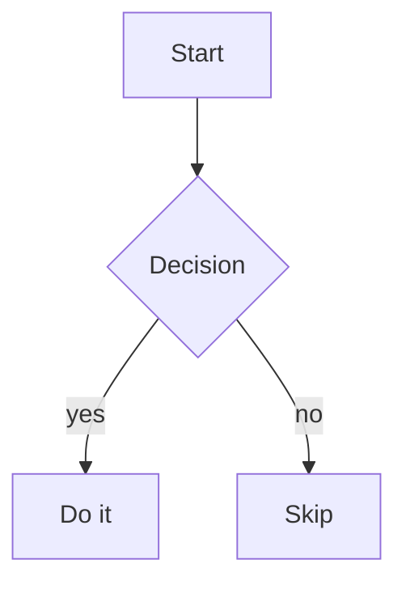

# Diagram

A diagram written as text in Mermaid syntax and rendered on view:
flowcharts, sequence diagrams, state machines, ER diagrams, Gantt
charts, class diagrams.

Text is the source here — which is what makes a diagram reviewable in
a diff and writable by an agent. If you want to drag boxes around
instead, use a graph; the trade is that a graph
has no notion of "sequence diagram".

## On disk

````markdown
---
kind: diagram
---


````

In YAML and JSON the diagram lives in a `source` field instead:

```yaml
$meta:
  kind: diagram
source: |
  flowchart TD
    A[Start] --> B{Decision}
```

The source is opaque to Vance — it is handed to the renderer as-is,
so any Mermaid feature the renderer supports works, and any Mermaid
syntax error surfaces as a render error rather than a save error.
Markdown text around the fence is preserved.

## In the editor

*View* renders it; *Edit* is the source. A syntax error shows the
renderer's message in place of the picture — the document still saves,
so you can leave a half-written diagram and come back to it.

## Common starts

```
flowchart TD          top-down boxes and arrows
sequenceDiagram       actors exchanging messages over time
stateDiagram-v2       states and transitions
erDiagram             entities and relations
gantt                 schedules
```
