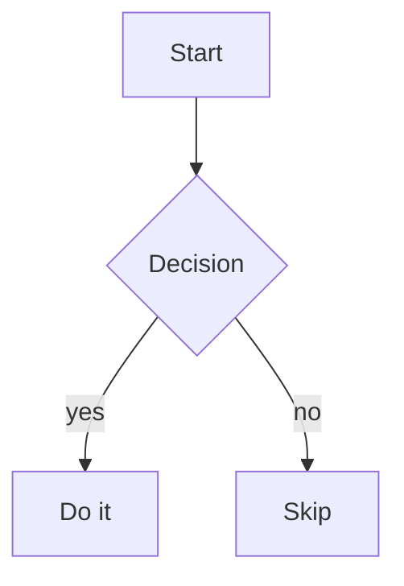

# Document kind — `diagram` (Mermaid)

Render a flowchart, sequence diagram, state machine, ER model, gantt
chart, gitGraph, journey, pie, C4 or timeline. The body is plain
Mermaid source — the Web-UI renders it to SVG; the Foot CLI shows
it as the source text.

## Two storage forms — pick by intent

Unlike `chart`/`graph`/`mindmap`, the **diagram kind explicitly
permits the ```` ```mermaid ```` fence inside a stored `.md` body**
— that's the canonical on-disk form per the diagram spec. JSON/YAML
with a `source: <DSL>` field is the alternative.

Decide first:

| Did the user ask for a saved file / document? | Use form |
|---|---|
| YES — "save the diagram", "speicher das als diagram-doc" | **Stored** (below) |
| NO — "show me a flowchart", "zeig den Ablauf als Sequenz" | **Inline** (further below) |

### Stored document — markdown with ```mermaid (canonical) OR JSON/YAML with source

Call `doc_create_kind(kind="diagram", path="<…>", body=<raw>)`.

**Markdown form** (path `<…>.md`) — canonical for diagram. The
body IS a markdown document with one ```` ```mermaid ```` fence
holding the Mermaid DSL. **This is the only Vance kind where a
fence inside the stored body is correct** — diagram is special
because Mermaid is a text DSL and markdown is its natural carrier.

````markdown

````

**YAML / JSON form** (path `<…>.yaml` or `.json`) — for tools that
need structured access to the Mermaid source as a string field:

```yaml
$meta:
  kind: diagram
source: |
  flowchart TD
    A[Start] --> B{Decision}
    B -->|yes| C[Do it]
    B -->|no| D[Skip]
```

Pick markdown for human-readable diagrams (the default), YAML/JSON
when a tool needs to extract the `source` field programmatically.

### Inline in chat — fence-wrapped, no tool call

When the user just wants to *see* the diagram right now in the
assistant's reply (no save, no `doc_create_kind`), emit a single
```` ```mermaid ```` fence in the chat message:

````

````

Same source as the stored markdown form — the only difference is
the wrapping markdown document.

## Mermaid diagram types

The first source line picks the diagram type. Common openings:

| Type | First line |
|---|---|
| Flowchart | `flowchart TD` (top-down) or `flowchart LR` (left-right) |
| Sequence | `sequenceDiagram` |
| State machine | `stateDiagram-v2` |
| ER model | `erDiagram` |
| Gantt | `gantt` |
| GitGraph | `gitGraph` |
| User journey | `journey` |
| Pie (simple) | `pie` |
| C4 architecture | `C4Context` / `C4Container` |
| Timeline | `timeline` |

## When to use this

User wants a *visual* of a process, architecture, or relationship —
"draw a flowchart", "zeig den Ablauf als Sequenz", "mach mir ein
ER-Diagramm". The expectation is **immediate visual output** in chat.

## Picking diagram vs. other kinds

- **chart** (`kind: chart`) — numerical data with axes (Line, Bar, Pie
  with values, Heatmap). Wants `{ x, y }`-style data points.
- **graph** (`kind: graph`) — m:n node/edge data the user wants to
  edit interactively. JSON `nodes`/`edges`.
- **mindmap** (`kind: mindmap`) — hierarchical brainstorm rendered
  radially. Outliner-editable.
- **diagram** (this one) — anything else visual, text-driven, not
  numerical: flowcharts, sequence, ER, state, gitGraph, C4, gantt.

Mermaid itself supports a `mindmap` diagram type. Don't use it — use
`kind: mindmap` (markmap) for real mindmaps; reserve `diagram` for
the typed diagrams above.

## Anti-patterns

- **No info string on the fence.** ` ``` ` alone (without `mermaid`)
  renders as plain `<pre>` — the diagram won't appear. Always start
  with ` ```mermaid`.
- **HTML/JS in the source.** The renderer enforces
  `securityLevel: 'strict'` — any `<script>`, inline event handler,
  or `javascript:` href is stripped or rejected. Don't try to embed
  interactivity that way.
- **Multiple diagrams in one fence.** One fence = one diagram. For
  several, emit several fences (each its own ` ```mermaid…``` `
  block), or save each as its own Document.
- **Pasting a Vance `chart` body.** Vance `chart` is a JSON/YAML
  schema, *not* Mermaid `pie`. They render differently and have
  different data models. For numerical data prefer `chart`.

## Failure surfacing

Bad Mermaid syntax does **not** crash the chat. The renderer shows a
banner with the parser error (e.g. *"Parse error on line 3: Expecting
NEWLINE, got SEMI"*) and the source for debugging. If you see the
banner echoed back in the next turn, fix the offending line and
re-emit the fence — Mermaid's error messages name the line number.

## When to graduate from inline to stored

Same trigger as other inline kinds:

- "Save this", "for later", "keep it around".
- Body grows past ~30 lines.
- Several diagrams that belong together as a set.

Then `doc_create_kind(kind="diagram", path="diagrams/<name>.md",
body=<markdown with one ```mermaid fence>)` and embed the returned
`markdownLink`. Reminder: **for diagram, the fence IS the stored
body** — unlike chart/graph/mindmap, you don't strip it for storage.
